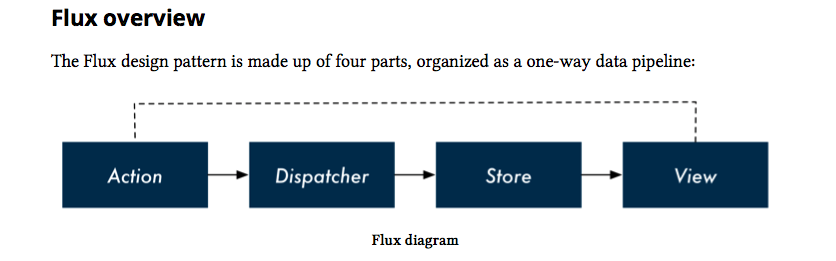

# Flux and Redux

A common pain point is the tight coupling between user interactions and state changes. For complex web applications, oftentimes a single user interaction can affect many different, discrete parts of the state.

## Flux is a Design Pattern



### Breaking up state management logic

As parts of the state tree become interdependent, most of an app’s state usually gets rolled up to a top-level component. Flux relieves the top-level component of state management responsibility and allows you to break up state management into isolated, smaller, and testable parts.

### React components are simpler

Certain component-managed state is fine, like activating certain buttons on mouse hover. But by managing all other state externally, React components become simple HTML rendering functions. This makes them smaller, easier to understand, and more composable.

### Mis-match between the state tree and the DOM tree

Oftentimes, we want to store our state with a different representation than how we want to display it.

## Flux Implementations

Flux is a design pattern, not a specific library or implementation.

While the available choices can be overwhelming, one community favorite has emerged: Redux.

Redux’s best feature is its simplicity. Stripped of its comments and sanity checks, Redux is only about 100 lines of code.

## Redux's key ideas

* All of your application’s data is in a single data structure called the state which is held in the
store
* Your app reads the state from this store
* The state is never mutated directly outside the store
* The views emit actions that describe what happened
* A new state is created by combining the old state and the action by a function called the
reducer

## Redux Example

```js
function createStore(reducer, initialState) {

  let state = initialState; // messages
  const listeners = [];

  const getState = () => (state);

  const dispatch = (action) => {
    state = reducer(state, action);
    listeners.forEach((l) => l());
  };

  const subscribe = (listener) => {
    listeners.push(listener);
  };

  return {
    getState,
    dispatch,
    subscribe
  };
}

function reducer(state, action) {
  if (action.type === 'ADD_MESSAGE') {
    return {
      messages: state.messages.concat(action.message),
    };
  } else if (action.type === 'DELETE_MESSAGE') {
    return {
      messages: [
        ...state.messages.slice(0, action.index),
        ...state.messages.slice(action.index + 1, state.messages.length)
      ]
    };
  } else {
    return state;
  }
}

const store = createStore(reducer, { messages: [] });
store.subscribe(() => console.log(store.getState()));

const action1 = {
  type: 'ADD_MESSAGE',
  message: 'Hello John'
};

const action2 = {
  type: 'ADD_MESSAGE',
  message: 'Hello Pere'
};

store.dispatch(action1);
store.dispatch(action2);
```

### Redux with React

```js
const App = React.createClass({
  componentDidMount: function () {
    store.subscribe(() => this.forceUpdate());
  },
  render: function () {
    const messages = store.getState().messages;
  }
});

const Message = React.createClass({
  handleDeleteClick: function () {
    store.dispatch({
      type: 'DELETE_MESSAGE', index: this.props.index,
    });
  },
  // ...
});
```