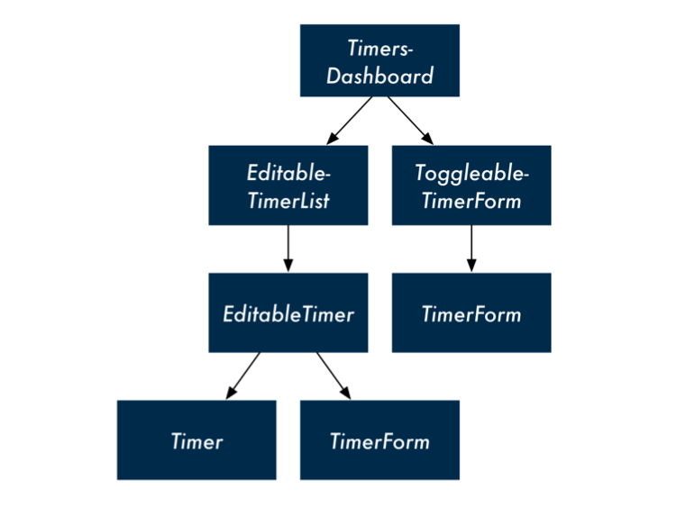

# Time Tracking App

## Run

```bash
npm start
```

## Components




## Libraries

## FETCH

Until Fetch, JavaScript developers had two options for making web requests: Use XMLHttpRequest which is supported natively in all browsers or import a library that provides a wrapper around it (like jQuery’s ajax()). Fetch provides a better interface than XMLHttpRequest. And while Fetch is still undergoing standardization, it is already supported by a few major browsers. At the time of writing, Fetch is turned on by default in Firefox 39 and above and Chrome 42 and above.

## uuid

For the id property, we’re using a library called uuid. We load this library in index.html. We use uuid.v4() to randomly generate a Universally Unique IDentifier25 for each item.